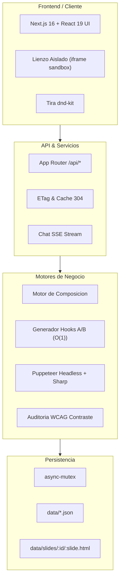

# Arquitectura del Sistema - SwipeForge

## 1. Vision Arquitectonica
SwipeForge es un sistema desacoplado para la creacion, edicion y exportacion de carruseles editoriales para redes sociales. Esta disenado para operar bajo alta concurrencia local o en servidor, garantizando consumo minimo de memoria y CPU.

## 2. Componentes Clave
- **Next.js 16 & React 19**: App Router, compilacion optimizada y eliminacion de cascading re-renders.
- **async-mutex**: Gestion de bloqueos para escrituras atomicas concurrentes (`safeWrite`).
- **Puppeteer Headless**: Generacion de capturas de pantalla de alta fidelidad con aislamiento de procesos y flags de ahorro de memoria (`--disable-dev-shm-usage`, `--no-zygote`).
- **Sharp & Archiver**: Optimizacion de buffers de imagen y empaquetado en archivos ZIP comprimidos.
